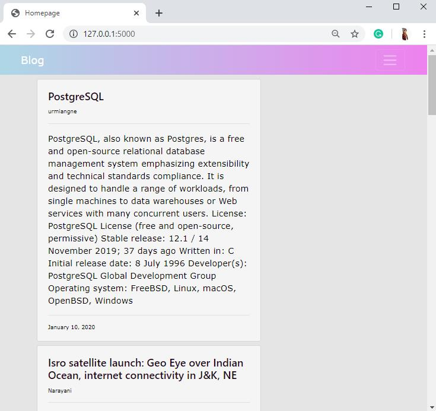
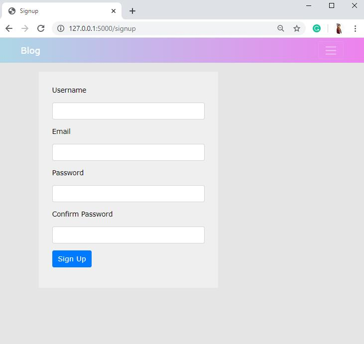
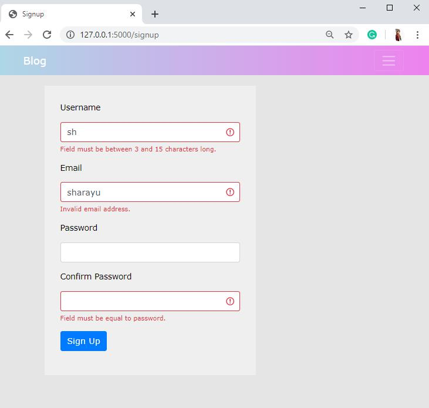
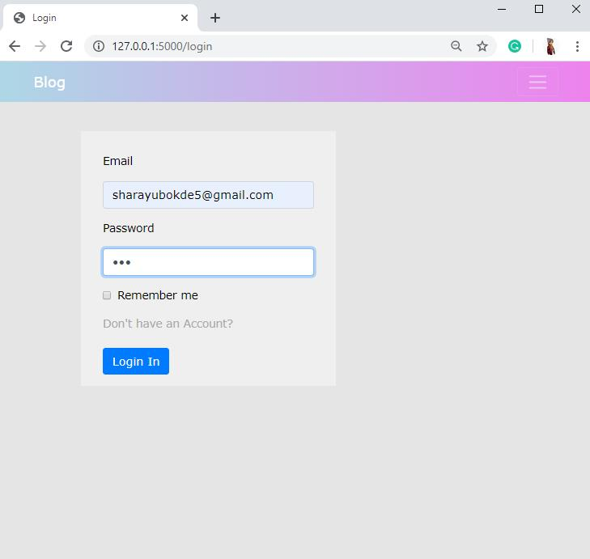
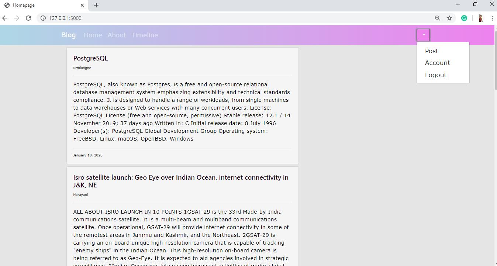
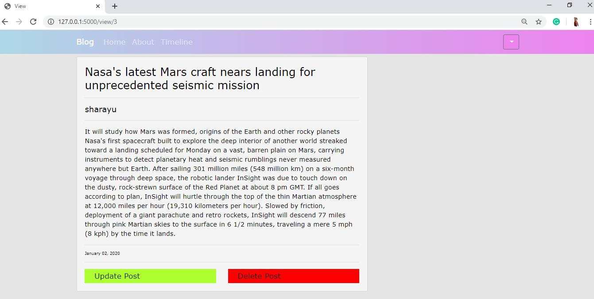
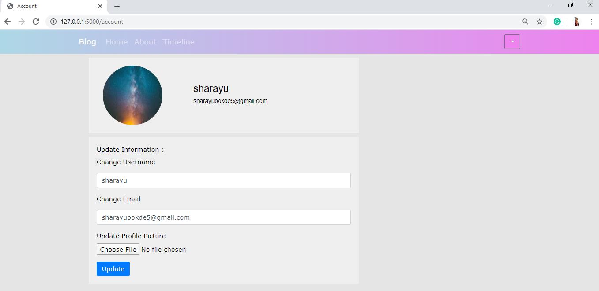

# Flask-Blog
<h3 align="center">A place where you can share ideas and news of current Technology and Sciences.</h3>

People can use this website to share their views, ideas or innovations in technology and science. Also, they can post news articles related to the topic. Apart from these, they can update or delete any post in the future as per the requirements. But to post articles on this website, the user needs to first create an account. After creating an account they can also update the account information like email-id, display picture or username. Also, they can view all their posts on their timeline which is an easy way to keep track of all the posts.

<h3>Technologies used : </h3>
<ul>
  <li>Python3</li>
  <li>Flask</li>
  <li>HTML</li>
  <li>CSS</li>
  <li>Bootstrap</li>
  <li>SQLAlchemy</li>
</ul>
<h3>Some images of the project : </h3>
Homepage :
<h3 align="center"></h3>

Register : 
<h3 align="center"></h3>
<h3 align="center"></h3>

Login : 
<h3 align="center"></h3>
<h3 align="center"></h3>

View Post : 
<h3 align="center"></h3>

Update Account Information :
<h3 align="center"></h3>

