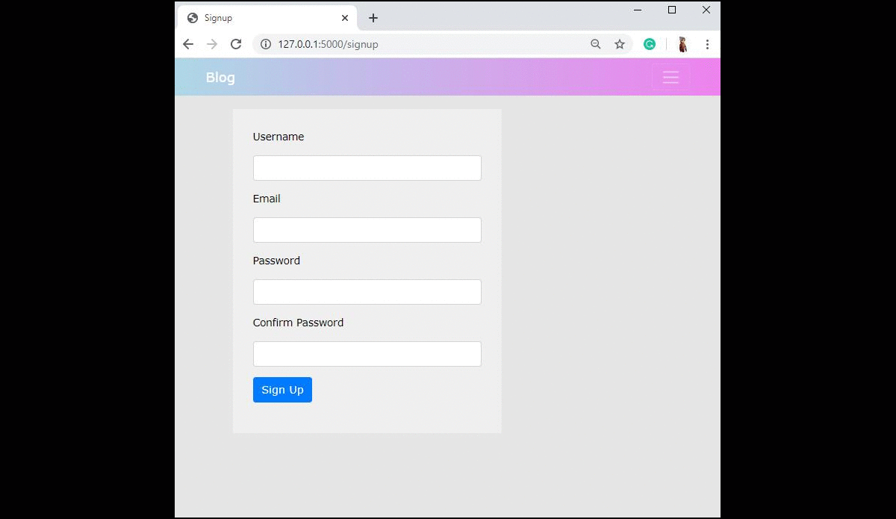

 

  <h1 align="center">Flask-Blog</h1>
  
  

    A place where you can share ideas and news of current Technology and Sciences.
     
    <a href="https://github.com/SharayuBokde/Blog"><strong>Explore the docs »</strong></a>
     
     
    View Demo
    ·
    <a href="https://github.com/SharayuBokde/Blog/issues">Report Bug</a>
    ·
    <a href="https://github.com/SharayuBokde/Blog/issues">Request Feature</a>
  

## About the Project
People can use this website to share their views, ideas or innovations in technology and science. Also, they can post news articles related to the topic. Apart from these, they can update or delete any post in the future as per the requirements. But to post articles on this website, the user needs to first create an account. After creating an account they can also update the account information like email-id, display picture or username. Also, they can view all their posts on their timeline which is an easy way to keep track of all the posts.

<h3 align="center"></h3>

## Built with 🔨
* Python3
* Flask
* HTML
* CSS
* Bootstrap
* SQLAlchemy

## Install

Clone the repository
    
    git clone https://github.com/SharayuBokde/Tourizto.git
  
Create and activate the virtual environment
    
    virtualenv venv
    cd scripts
    activate
      
Navigate back to the main folder. Install the requirements and run `untitled.py` to start the application

    pip install -r requirements.txt
    python untitled.py

